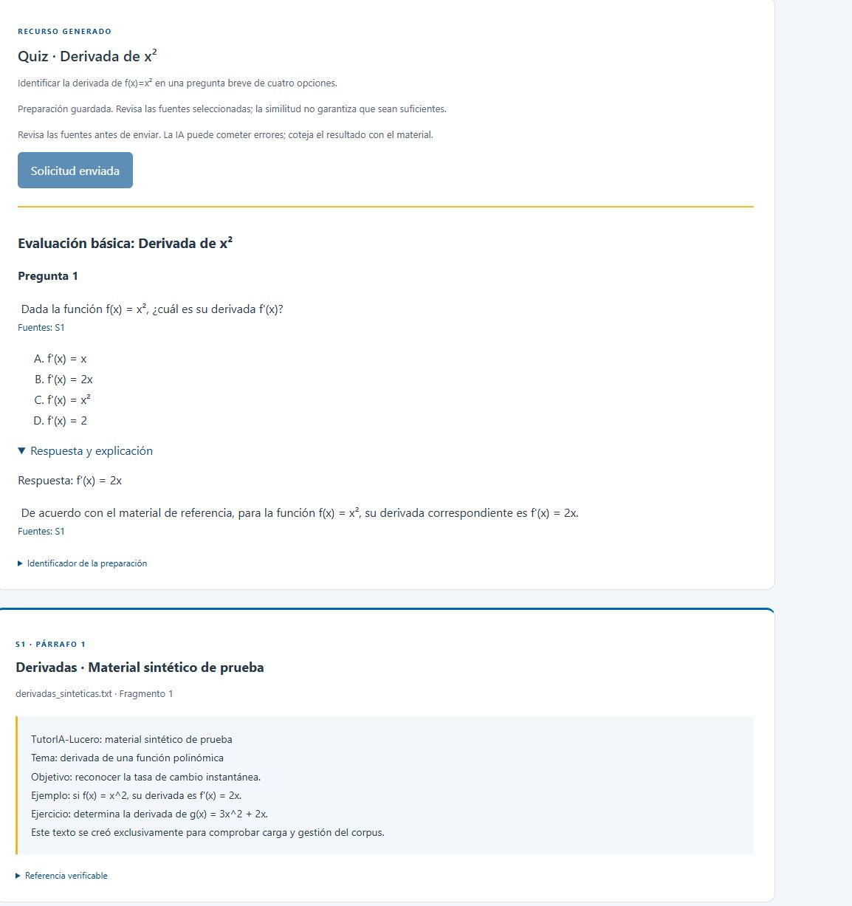

# Hito 7: ejercicio, quiz y retroalimentación reales

Fecha local: 7 de octubre de 2026, sesión nocturna. Proyecto Gemini Free Tier confirmado previamente por el autor; presupuesto autorizado USD 0, sin cambios de facturación. Solo material/respuesta sintéticos. Modelo gemini-3.1-flash-lite, entrada máxima 12000 caracteres, salida máxima 512 tokens, timeout 30 s.

## Resultados persistidos

| Tipo | Identificador | Input | Output | Total | Latencia |
|---|---|---:|---:|---:|---:|
| Ejercicio | 34cbaee3-9dbe-40f6-a41b-65e3568d606b | 1115 | 324 | 1439 | 2088 ms |
| Quiz (una pregunta) | 42289db1-b80a-4290-b7bd-b26d1b03b845 | 1168 | 222 | 1390 | 7516 ms |
| Retroalimentación | 77754fbb-be92-4495-bdae-781db4a6b964 | 1080 | 250 | 1330 | 14146 ms |

Tres estados succeeded confirmados en PostgreSQL, con una fuente S1 del documento sintético 84ed0928-238d-46ec-9de2-8f704249ddc3/fragmento 25136e79-2641-45c7-938b-a295cc3a54e5. Evidencia exportada en hito_07_recursos_reales.json: recurso validado, modelo, consumo, fechas, fuente e identificador, sin prompt/clave/propietario/respuesta de estudiante.

Una llamada por preparación, tres nuevas en este bloque, separadas al menos 60 s y reservadas en BD. Corresponden al día UTC 8 de octubre (aún 7 de octubre local); el ensayo previo de explicación fue en el día UTC anterior. Costos desconocidos/null, sin afirmar cargo efectivo cero. No se reintentó ni se usó fallback.

## Recorrido desde Angular

Ejercicio: objetivo derivar x², presentó enunciado, pista, solución guiada y resultado 2x con S1. Quiz: una pregunta, opciones x/2x/x²/2; respuesta y explicación desplegables con 2x y S1. Feedback: respuesta ficticia f'(x)=x; presentó revisión/corrección a 2x/siguiente paso con S1, sin nombres ni datos de estudiantes reales. Los tres aparecen en Mis recursos y se reabrieron mediante GET sin nuevas llamadas; terminales mantienen Solicitud enviada deshabilitado.

Capturas verificadas: hito_07_ejercicio_real.png, hito_07_quiz_real.png y hito_07_feedback_real.png. Se corrigió la captura inicial del quiz para evitar que la cabecera sticky ocultara su contexto; recurso/citas completos y respuesta desplegada en la evidencia final.

## Verificación y alcance

Angular: 50 pruebas aprobadas en 13 archivos, 33,19 s durante arranque del entorno. Tres nuevas comprobaciones de presentación de ejercicio/quiz/feedback, cuatro opciones y respuesta correcta del contrato quiz. Backend sin cambios en este bloque: 247 pruebas aprobadas previamente, 18,92 s; no se repitieron como si fueran nuevas. Docker recuperado tras motor detenido; datos/modelos conservados. Selector de accesos mock restaurado a student después de renovar sesión docente ficticia. No se modificó CAS ni .env/clave/facturación.

Explicación anterior más estos ensayos cubren técnicamente los cuatro recorridos mínimos. No son benchmark ni evaluación pedagógica/matemática independiente. En la pista del ejercicio se revela la regla y la solución, apropiado para esta demostración básica pero pendiente de rúbrica pedagógica. Feedback propone un ejercicio que requiere además linealidad/derivada del término lineal; no atribuir respaldo semántico completo al hecho de citar S1. Quiz de 2–5 preguntas y respuestas largas no se han verificado externamente con 512 tokens; si se excede el máximo se rechaza la salida, no se aumenta el presupuesto automáticamente.

Próxima etapa: hito 8, API de perfiles sintéticos desde rendimiento externo, conservando privacidad/propiedad y sin vincular estudiantes reales ni adaptar generación hasta validar sus contratos. Evaluación académica/retención/purga/métricas y CAS TI pendientes.
