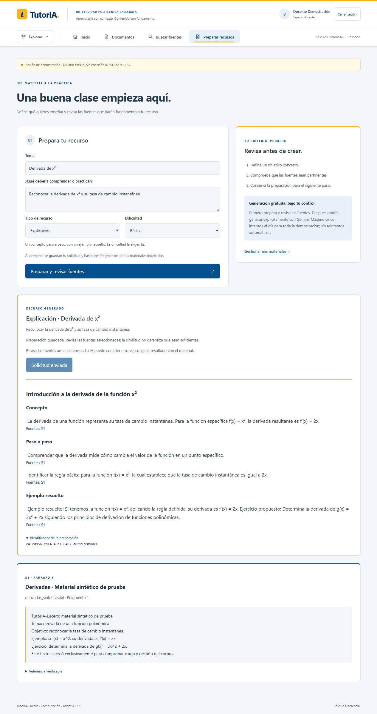
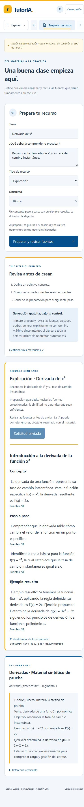

# Hito 7: generación desde Angular con cupo persistente

Fecha: 7 de octubre de 2026. Hito 7 en curso, no evaluación académica final.

## Cambio comprobado

Preparación privada existente → revisión de fuentes → POST /api/v1/content/{id}/generate con cuerpo vacío → reserva SQL confirmada → una llamada Gemini → validación/persistencia → presentación de recurso/citas o fallo. Modelo y clave exclusivamente backend. Permisos teacher/admin, propietario, CSRF, no-store y cuerpo hasta 16 KiB. Estados prepared/generating/succeeded/failed y migration 0007; anteriores inmutables.

Cinco intentos globales/día UTC (incluidos fallos), 60 s entre inicios y una llamada simultánea, coordinación mediante bloqueo transaccional PostgreSQL. Preparación de un solo envío, terminal inmutable, sin fallback/reintentos. Interrupciones >90 s se cierran al reclamar otra preparación sin reenviar; publicación tardía rechazada. Scripts manuales fuera del cap. Free Tier confirmado por el autor, USD 0 autorizado, sin cambios de facturación; no se mide gasto.

## Verificación automática

- Backend completo en Docker Python 3.12/PostgreSQL: 244 aprobadas, 17,41 s. Dos advertencias conocidas Starlette/HTTPX y pypdf.
- Angular: 44 aprobadas, 12 archivos. Protecciones contra doble envío y HTML activo incluidas.
- Ruff check y format --check: 130 archivos limpios.
- Build Angular: sin advertencias, 304,45 kB inicial, preparación 19,14 kB lazy.
- docker compose up -d --build --wait: backend/frontend/postgres saludables.

Las pruebas SQL nuevas cubren propietario, reserva confirmada/sin transacción durante red, rechazo de segundo envío, límite global entre propietarios/repositorios, fuentes eliminadas e interrupción/publicación tardía. API cubre roles/CSRF, datos seguros, configuración cliente rechazada, límite de cuerpo y desactivación. Tests automáticos sin API externa.

## Una llamada real desde navegador

Sesión docente ficticia; tema Derivada de x², objetivo reconocer su tasa de cambio instantánea. Fuente única S1: Derivadas · Material sintético de prueba, documento 84ed0928-238d-46ec-9de2-8f704249ddc3, fragmento 25136e79-2641-45c7-938b-a295cc3a54e5. No corpus institucional/perfiles/credenciales en contenido.

Preparación e4fcd956-cdf4-43a1-8487-d82997e096b3, reserva 2026-10-07 22:06:57.659875 UTC. SQL confirmó succeeded, gemini, gemini-3.1-flash-lite, 1076 input/312 output/1388 total, 2355 ms, sin error. Costo desconocido/null. Navegador mostró título Introducción a la derivada de la función x², concepto, pasos, ejemplo y citas S1; botón Solicitud enviada deshabilitado. No se pulsó nuevamente ni se enviaron llamadas para probar un bloqueo ya cubierto offline.

Se verificó renderización en escritorio y móvil 390×844; ancho útil y scrollWidth 375 px sin desbordamiento. Viewport restaurado, pestaña conservada. Capturas:

## Límites del resultado y siguiente paso

Validación de JSON/citas conocidas no demuestra precisión matemática ni respaldo semántico. UI admite cuatro contratos, pero en este bloque solo se llamó realmente para explicación. Recargar pierde la vista; BD conserva resultado/snapshot. Próximo bloque: historial privado para recuperarlos sin nueva inferencia. Pendientes recorridos reales restantes, evaluación con rúbrica/corpus autorizados, perfiles/adaptación y retención/purga. No dar por cerrado hito 7/10.
