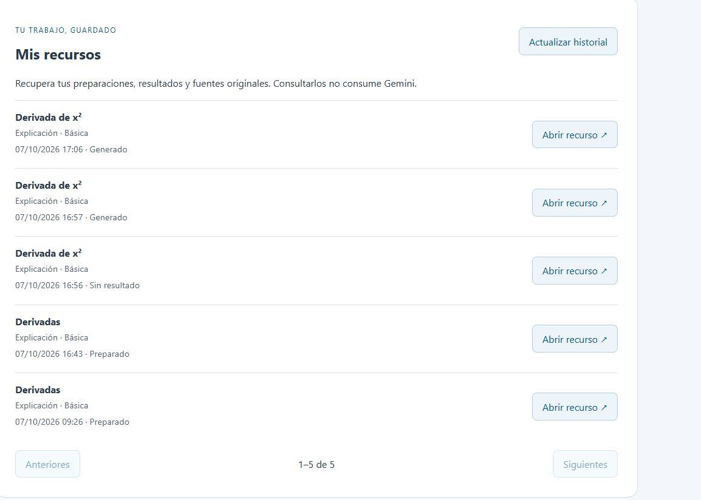

# Hito 7: historial privado y recuperación de resultados

7 de octubre de 2026. GET paginado y detalle propios implementados con repositorio/servicio/DTO separados, sin nueva migración. Permisos teacher/admin y filtro owner incluso admin, no-store. Lista selectiva sin cargar prompts/texto de fuentes/recursos completos. Detalle reconstruye snapshot y recurso original, sin claves/prompts/respuesta de estudiante ni llamada LLM.

Mis recursos en /recursos permite abrir preparaciones, éxitos, fallos y pendientes, con fecha/tipo/dificultad/estado y páginas de diez. Estados terminales/pendientes mantienen reenvío bloqueado. No hay auto-polling, almacenamiento de contenido en navegador ni inferencia al consultar.

Pruebas: 247 backend/PostgreSQL aprobadas en 18,92 s, dos advertencias conocidas; 47 Angular en 13 archivos; Ruff check/format 135 archivos limpios. Build Docker sin advertencias, servicios saludables. Compilación previa del bloque: 305,44 kB inicial y 24,81 kB preparación; build Docker final también pasó. Tests nuevos cubren propiedad/paginación estable, detalle de snapshot sin documento vivo, fallo/pendiente conservados, límites/roles/no-store y lecturas GET sin POST/bloqueo de reenvío en Angular.

Navegador tras recargar: listado real de cinco entradas, apertura del fallo sintético 16:56 y del éxito 17:06 (ID e4fcd956-cdf4-43a1-8487-d82997e096b3). Resultado original y citas S1 recuperados, botón Solicitud enviada bloqueado. SQL confirmó contador API diario sigue en uno; cero llamadas Gemini nuevas en este bloque. Móvil 390×844 solicitado, ancho útil/scrollWidth 375 px sin desbordamiento; viewport restaurado. Capturas hito_07_historial_desktop.png, mobile.png y resumen.png.

Pendientes: recorridos externos restantes con datos sintéticos/cupo vigente, evaluación académica independiente, métricas/retención/purga/perfiles. La lista y el total usan lecturas separadas: una inserción concurrente puede cambiar el total entre ellas; orden estable para un conjunto sin inserciones. No equivale al cierre completo del hito 10.
