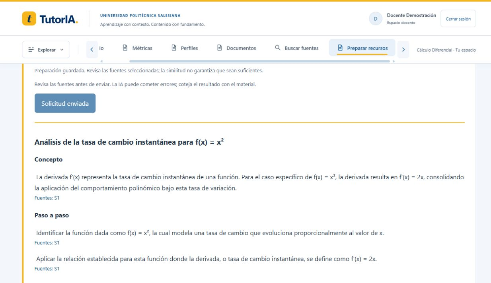
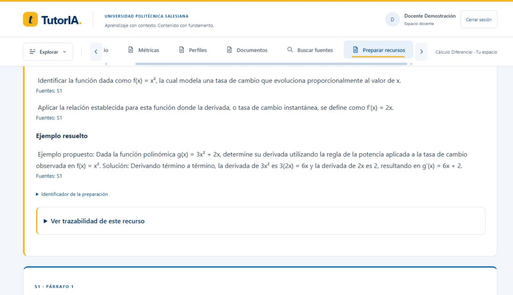

# Comparación exploratoria de tres perfiles: ejecución completada

9 de octubre de 2026, America/Guayaquil. Continuación del
[registro parcial](hito_09_comparacion_parcial.md), siguiendo el
[protocolo fijado antes de las salidas](hito_09_protocolo_comparacion.md).
Se completaron tres recorridos técnicos; no se declara cierre académico del hito 9.
Evidencia íntegra de entradas/salidas sintéticas: [JSON](hito_09_comparacion_completa.json).
La evidencia parcial anterior se conserva sin sustituir su estado histórico.

## Condiciones conservadas

Preparación alta original 32960f76-5d6d-43b7-9e9b-8d552c9970ed recuperada del historial.
Modelo gemini-3.1-flash-lite, política profile-adaptation-v1, prompt educational-rag-profile-v2,
cap de cinco reservas/día UTC y salida máxima 512 tokens, sin reintentos ni cambios de corpus.
SQL confirmó tres registros, un sources_snapshot distinto y una sola entrada fija al excluir
la dificultad; perfiles académicos fijos idénticos al excluir UUID/fecha/identificador/dominio.
Fuente/alias S1 y hash de texto 6a88d828d463dd478ed9927fc3c2aedd190b91ebd0387e88156d70f08d3f34c1.

| Dominio | Dificultad | Estado | Inicio UTC | Entrada / salida / total | Latencia |
|---|---|---|---|---|---|
| low | basic | succeeded | 2026-10-08 23:12:00.014684 | 1161 / 381 / 1542 | 1951 ms |
| medium | intermediate | succeeded | 2026-10-08 23:13:24.999215 | 1154 / 339 / 1493 | 1999 ms |
| high | advanced | succeeded | 2026-10-09 09:08:15.637445 | 1156 / 386 / 1542 | 18901 ms |

El alto se envió el 9 a las 04:08 de Guayaquil, después de renovar cuota. Separación temporal
de casi diez horas respecto de bajo/medio; posibles variaciones del proveedor no controladas.
Temperatura/semilla no se fijan. Una llamada nueva, contador UTC 9 = 1, sin repetir las otras
dos. Total del conjunto: 4577 tokens conocidos; costo null/desconocido, sin factura verificada.
La mayor latencia del alto no demuestra mayor esfuerzo cognitivo ni causa del perfil.

## Lectura exploratoria

Bajo: dos pasos y explicación extensa. Medio: tres pasos más breves. Alto: dos pasos y ejemplo
con g(x)=3x²+2x, cuya solución propuesta g'(x)=6x+2 es matemáticamente correcta. Hay un cambio
observable de complejidad del ejemplo alto, pero no evidencia suficiente de adecuación o mejora
de aprendizaje. No se asignan calificaciones/rúbricas retrospectivas.

Limitaciones: bajo/medio introducen la regla general de potencia no enunciada explícitamente
en S1. Alto usa además derivación término a término, regla de potencia y derivada del término
lineal: el ejercicio g(x) figura en la fuente, pero esas reglas y su solución no. El objetivo
fijo exigía explicar x² usando solo el ejemplo de la fuente; la ampliación a g(x) se aparta de
ese alcance. La orientación avanzada de adaptación debe quedar subordinada al objetivo
explícito y a la evidencia disponible. Citas válidas y JSON no detectan esta desviación semántica.

## Persistencia y cierre técnico

Tras recargar Angular, la explicación alta se recuperó desde historial como succeeded y el
envío quedó bloqueado. Se conservó su adaptación y sus fuentes; ninguna lectura volvió a
consumir Gemini. Sesión docente ficticia renovada; selector de nuevos logins restaurado a
student. Docker iniciado con volúmenes previos y saludable. No hubo cambios de código en
este bloque de comparación: suites aprobadas anteriores 296 backend/61 Angular se conservan,
sin repetirlas para añadir evidencia.

Siguiente trabajo: reforzar para futuras preparaciones la prioridad del objetivo/fuentes
sobre la orientación adaptativa, con versión nueva sin modificar estos snapshots ni repetir
este conjunto para ocultar resultados. Evaluación posterior requiere corpus suficiente y
rúbrica/protocolo definidos antes de generar. Retención y benchmark permanecen pendientes.
