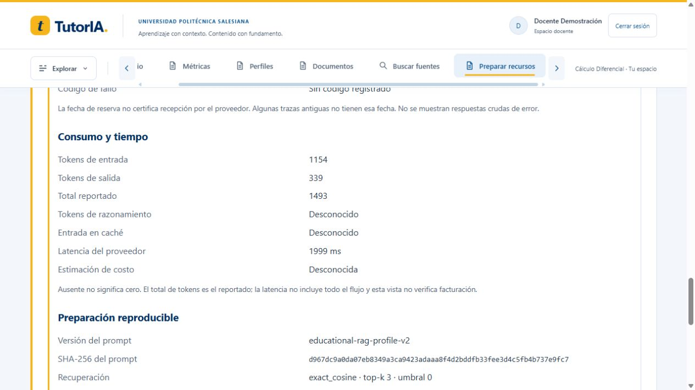
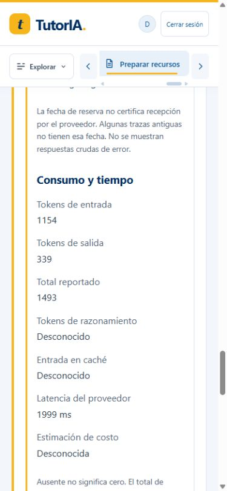

# Hito 10 — Metadatos por recurso

Implementación y verificación: 8 de octubre de 2026, America/Guayaquil. Cierre documental:
9 de octubre. Punto técnico de auditoría cerrado; retención/costo/evaluación siguen pendientes.

- Backend Docker: **296 pruebas aprobadas**, 32.44 s, dos avisos de deprecación conocidos.
  Integración comprueba snapshots/hash de prompt, permisos, cero reportado, uso parcial,
  traza sin reserva, fallo seguro y exclusión de código de error desconocido. Savepoints
  revertidos, sin datos persistentes de prueba ni llamadas externas.
- Angular: **61 pruebas en 16 archivos**, 10.92 s. Datos faltantes, cero conocido,
  metadatos escapados y compatibilidad sin auditoría, además de suites previas.
- Ruff aprobado; build Docker inicial 306.23 kB, preparación lazy 34.55 kB,
  sin advertencias. Compose terminó con backend/frontend/PostgreSQL saludables.
- Navegador: recurso intermedio 39f18cd0-5529-4e25-a025-81f098d56033 recuperado;
  1154/339/1493 tokens, 1999 ms, Gemini 3.1 Flash-Lite, educational-rag-profile-v2,
  SHA-256 d967dc9a0da07eb8349a3ca9423adaaa8f4d2bddfb33fee3d4c5fb4b737e9fc7,
  recuperación exact_cosine y revisión E5 visibles.
- Traza fallida anterior: llm_timeout, tokens/latencia/costo desconocidos y sin fecha
  de reserva. No se sustituyen por cero ni se reintenta la generación.
- Preparación alta abierta después: prepared, sin proveedor/fecha de finalización,
  hash a66539acff2d5c2341812fcaa2c19c5ae03561367a58cacc851141a7f4f78300;
  no conserva los metadatos del recurso intermedio. No se envió en esta verificación.
- Móvil: override 390×844, ancho DOM/contenido 375 px, sin desbordamiento,
  metadatos en una columna; override restaurado.

No hubo llamadas Gemini durante este bloque de auditoría. La fecha de generación real alta,
cuando se realice, se registrará por separado. El 9 de octubre Docker estaba detenido y se
inició para continuar; no se borraron volúmenes ni se rehicieron resultados previos.

Contrato: [auditoria_recursos.md](../api/auditoria_recursos.md).
