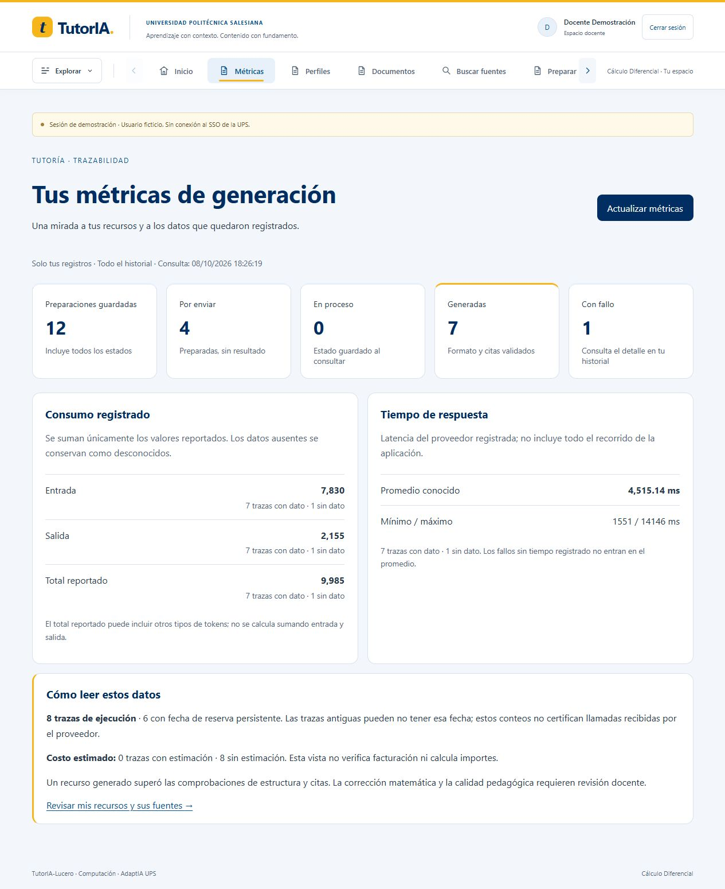
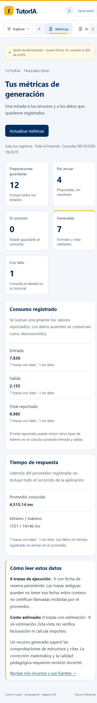

# Hito 10 — Primer bloque de métricas privadas

8 de octubre de 2026, America/Guayaquil. Punto técnico implementado; hito 10 completo sigue
abierto por retención/purga, metadatos detallados y estimación monetaria versionada.

## Verificación automática

- Backend Docker/Python 3.12: **295 pruebas aprobadas**, 29.51 s. Dos avisos previos de
  deprecación Starlette/httpx y pypdf; ninguna llamada externa en la suite.
- Integración PostgreSQL: registros privados en savepoints revertidos; estados mixtos,
  consumo parcial/cero conocido, trazas antiguas sin reserva, promedio solo de valores
  conocidos, ausencia de contaminación por otro propietario y consultas repetidas sin cambio.
- API: teacher/admin propios, student 403, sin sesión 401, no-store, solo GET; un owner_id
  enviado por el cliente no cambia el propietario de sesión. Respuesta sin prompts/perfiles.
- Angular: **59 pruebas aprobadas en 15 archivos**, 54.04 s. Carga única, bloqueo de lectura
  duplicada, ausencias visibles, error sin reintento automático y student sin consulta.
- Ruff: aprobado. Build de producción Docker: inicial **306.23 kB**, ruta lazy métricas
  **9.51 kB**, sin advertencias. Compose completó con backend/frontend/postgres saludables.

## Navegador sobre datos sintéticos conservados

Sesión docente ficticia existente, selector de nuevos logins sigue student. `/metricas`:

| Medida | Valor observado |
|---|---|
| Total de preparaciones | 12 |
| Prepared / generating / succeeded / failed | 4 / 0 / 7 / 1 |
| Trazas de ejecución / reservas con fecha | 8 / 6 |
| Tokens de entrada conocidos | 7830; 7 trazas con dato, 1 sin dato |
| Tokens de salida conocidos | 2155; 7 con dato, 1 sin dato |
| Total reportado conocido | 9985; 7 con dato, 1 sin dato |
| Latencia promedio conocida | 4515.14 ms; 7 con dato, 1 sin dato |
| Latencia mínimo / máximo | 1551 / 14146 ms |
| Cobertura de estimación de costo | 0 conocidas, 8 desconocidas; sin importe calculado |

Se verificaron navegación activa y botón Actualizar métricas; la lectura mostró los mismos
agregados y nueva fecha. No creó preparaciones ni consumió cuota de generación.
Escritorio con estilo UPS y móvil con override 390×844: DOM efectivo 375 px, scrollWidth
375 px, sin desbordamiento horizontal. Override restablecido después de la revisión.

## Pendientes conservados

No hubo llamadas Gemini nuevas. La preparación alta
32960f76-5d6d-43b7-9e9b-8d552c9970ed sigue prepared: cinco reservas el día UTC 8.
Renovación UTC 9 corresponde a las 19:00 del 8 de octubre en Guayaquil; no se programa
ejecución. Comparación académica sigue parcial y sus limitaciones no se corrigen alterando
retroactivamente el corpus. No se presentan estas métricas técnicas como mejora de aprendizaje,
facturación verificada o benchmark multi-proveedor.

Contrato [metricas.md](../api/metricas.md) y decisión
[0011](../decisiones_tecnicas/0011-metricas-privadas.md).
